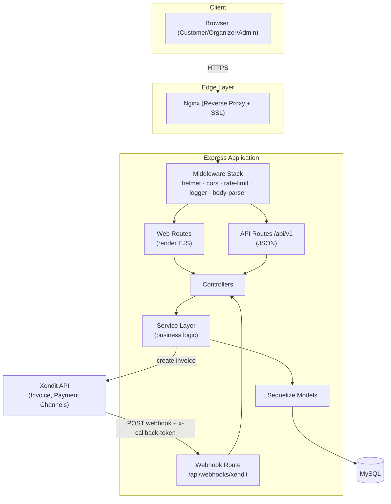
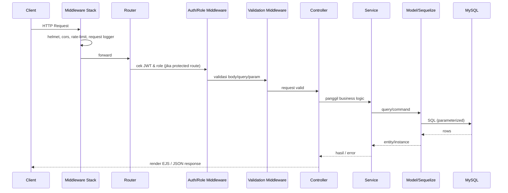
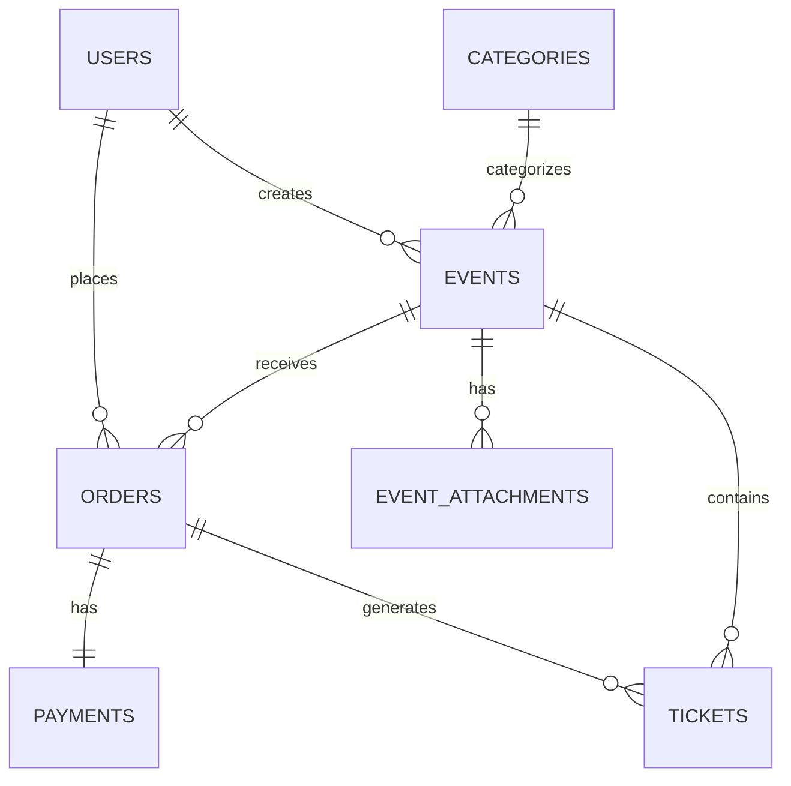
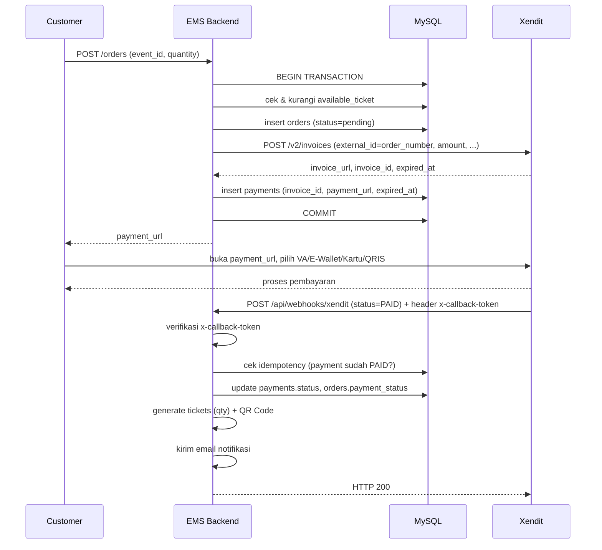
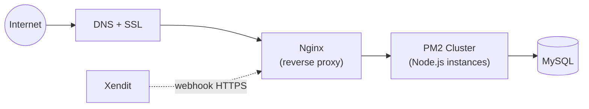

# 🏗️ Architecture Document — Event Management System

## 1. Ringkasan

Event Management System (EMS) dibangun sebagai **modular monolith** menggunakan Express.js, dengan MySQL sebagai penyimpanan utama melalui Sequelize ORM. Aplikasi menyajikan dua permukaan (surface) dari satu codebase yang sama:

1. **Web Interface (EJS)** — halaman publik (browse/detail event, checkout), serta dashboard Organizer & Admin.
2. **REST API (JSON)** — di bawah prefix `/api/v1`, dipakai untuk AJAX di sisi client, kebutuhan integrasi eksternal di masa depan (mobile app), dan endpoint webhook Xendit.

Kedua permukaan ini **berbagi Service Layer & Model yang sama**, sehingga tidak ada duplikasi business logic — controller EJS dan controller API sama-sama memanggil service yang identik, hanya berbeda di cara merender output (`res.render(...)` vs `res.json(...)`).

## 2. Prinsip & Gaya Arsitektur

EMS mengikuti **Layered Architecture** (mirip MVC + Service Layer):

```
Route → Middleware → Controller → Service → Model (Sequelize) → MySQL
```

Prinsip yang dipegang:

- **Separation of Concerns** — Controller hanya menangani HTTP (request/response), tidak berisi business logic.
- **Fat Service, Thin Controller** — semua aturan bisnis (validasi kuota tiket, kalkulasi total, status mapping payment) hidup di Service layer agar dapat dipakai ulang oleh web & API controller.
- **Single Source of Truth untuk skema** — seluruh akses data lewat Sequelize Model, tidak ada raw query tersebar di controller (mitigasi SQL Injection sekaligus memudahkan maintenance).
- **Konfigurasi via Environment Variable** — tidak ada nilai sensitif (secret key, credential) yang di-hardcode.

## 3. Diagram Arsitektur Tingkat Tinggi



## 4. Lapisan Aplikasi (Component Breakdown)

| Layer           | Tanggung Jawab                                                                                            |
| --------------- | --------------------------------------------------------------------------------------------------------- |
| **Routes**      | Mendefinisikan endpoint & memetakan ke controller; memisahkan `web/` (EJS) dan `api/v1/` (JSON)           |
| **Middlewares** | Autentikasi (JWT), otorisasi (role), validasi input, rate limiting, error handling, upload file           |
| **Controllers** | Menerima request, memanggil service, mengembalikan response (`render` atau `json`) — tanpa business logic |
| **Services**    | Business logic murni: validasi kuota, kalkulasi harga, integrasi Xendit, generate ticket/QR, dsb.         |
| **Models**      | Definisi tabel & relasi Sequelize, termasuk validasi tingkat model                                        |
| **Validations** | Schema validasi input per entity (dipisah dari controller agar reusable)                                  |
| **Jobs**        | Cron/scheduled task (expire order pending, reminder event)                                                |
| **Views (EJS)** | Presentasi HTML untuk web interface & dashboard                                                           |
| **Utils**       | Helper lintas modul: response envelope, generator kode order/tiket, QR, logger instance                   |

## 5. Struktur Folder

```
src/
├── config/
│   ├── database.js          # koneksi Sequelize (dev/test/prod)
│   ├── xendit.js             # instance client Xendit
│   ├── logger.js             # instance Winston
│   └── multer.js             # konfigurasi upload
├── models/
│   ├── index.js
│   ├── user.model.js
│   ├── category.model.js
│   ├── event.model.js
│   ├── eventAttachment.model.js
│   ├── order.model.js
│   ├── payment.model.js
│   └── ticket.model.js
├── migrations/
├── seeders/
├── controllers/
│   ├── web/                  # controller untuk render EJS
│   └── api/v1/               # controller untuk response JSON
├── services/
│   ├── auth.service.js
│   ├── event.service.js
│   ├── order.service.js
│   ├── xendit.service.js
│   ├── ticket.service.js
│   ├── notification.service.js
│   └── report.service.js
├── routes/
│   ├── web/
│   ├── api/v1/
│   └── index.js
├── middlewares/
│   ├── auth.middleware.js
│   ├── role.middleware.js
│   ├── error.middleware.js
│   ├── validate.middleware.js
│   ├── rateLimiter.middleware.js
│   └── upload.middleware.js
├── validations/
├── jobs/
│   └── expireOrders.job.js
├── utils/
│   ├── apiResponse.js
│   ├── generateOrderNumber.js
│   ├── generateTicketCode.js
│   ├── qrCode.js
│   └── errors/               # custom error classes
├── views/
│   ├── layouts/
│   ├── partials/
│   ├── auth/
│   ├── events/
│   └── dashboard/{organizer,admin}/
├── public/
│   ├── css/ · js/ · uploads/
├── app.js                    # setup express, middleware, routes
└── server.js                 # entry point (listen)
```

## 6. Alur Request (Request Lifecycle)



Jika terjadi error di titik mana pun, error dilempar ke **global error middleware** (lihat §11), bukan ditangani manual di tiap controller.

## 7. Arsitektur Database

### 7.1 Ringkasan Entitas

Mengacu pada desain database proyek (7 tabel inti): `users`, `categories`, `events`, `event_attachments`, `orders`, `payments`, `tickets`.



Detail kolom & tipe data ada di [`specification.md`](./specification.md#2-skema-database-detail).

### 7.2 Strategi Indexing

| Tabel      | Kolom                       | Tipe Index      | Alasan                                                            |
| ---------- | --------------------------- | --------------- | ----------------------------------------------------------------- |
| `users`    | `email`                     | UNIQUE          | Login & pencegahan duplikat akun                                  |
| `events`   | `slug`                      | UNIQUE          | Lookup detail event via URL publik                                |
| `events`   | `creator_id`, `category_id` | INDEX (FK)      | Filter "event milik organizer X" / "per kategori"                 |
| `events`   | `status`, `event_date`      | COMPOSITE INDEX | Query "event published & akan datang" (dipakai di halaman browse) |
| `orders`   | `order_number`              | UNIQUE          | Lookup order & rekonsiliasi pembayaran                            |
| `orders`   | `user_id`, `event_id`       | INDEX (FK)      | Riwayat order per user / per event                                |
| `payments` | `order_id`                  | UNIQUE (FK)     | Relasi 1:1 dengan order                                           |
| `payments` | `external_id`, `invoice_id` | INDEX           | Pencarian saat webhook masuk                                      |
| `tickets`  | `ticket_code`               | UNIQUE          | Validasi saat scan/check-in                                       |
| `tickets`  | `order_id`, `event_id`      | INDEX (FK)      | Rekap tiket per order / per event                                 |

### 7.3 Normalisasi

Skema mengikuti **3NF**. Pengecualian yang disengaja (denormalisasi terkontrol) untuk performa baca:

- `orders.subtotal`, `service_fee`, `total_amount` disimpan sebagai kolom (bukan dihitung ulang setiap saat) agar riwayat order tidak berubah meski `ticket_price` di `events` berubah di kemudian hari.
- `events.available_ticket` di-maintain sebagai counter (bukan `SELECT COUNT(*)` dari `tickets` setiap request) demi kecepatan validasi kuota saat checkout — di-update dalam **database transaction** agar tetap konsisten (lihat §9).

## 8. Arsitektur Autentikasi & Otorisasi

- **Skema:** JWT (JSON Web Token), disimpan di **httpOnly cookie** (`token`) — aman dari akses JavaScript client-side (mitigasi XSS) sekaligus otomatis terkirim di request browser (cocok untuk halaman EJS) maupun dibaca manual untuk klien API non-browser.
- **Middleware `authenticate`**: membaca token dari cookie (fallback ke header `Authorization: Bearer <token>` untuk klien API), verifikasi signature, decode payload (`id`, `role`), attach ke `req.user`.
- **Middleware `authorize(...roles)`**: membandingkan `req.user.role` dengan role yang diizinkan pada route tersebut.

```mermaid
sequenceDiagram
    participant U as User
    participant App as Express App
    participant DB as MySQL

    U->>App: POST /auth/login (email, password)
    App->>DB: cari user by email
    DB-->>App: user + hashed password
    App->>App: bcrypt.compare(password, hash)
    App->>App: generate JWT (sign dengan JWT_SECRET)
    App-->>U: Set-Cookie: token=<jwt>; httpOnly; secure
    U->>App: request berikutnya (cookie otomatis terlampir)
    App->>App: authenticate → authorize(role)
    App-->>U: response sesuai izin role
```

### Matriks Otorisasi (ringkas)

| Aksi                    | Customer |      Organizer      |   Admin    |
| ----------------------- | :------: | :-----------------: | :--------: |
| Browse/lihat event      |    ✅    |         ✅          |     ✅     |
| Buat & kelola event     |    ❌    | ✅ (milik sendiri)  | ✅ (semua) |
| Order & bayar tiket     |    ✅    |         ❌          |     ❌     |
| Validasi/check-in tiket |    ❌    | ✅ (event miliknya) |     ✅     |
| Kelola kategori & user  |    ❌    |         ❌          |     ✅     |

Matriks lengkap ada di [`specification.md`](./specification.md) & dokumen fitur asli proyek.

## 9. Arsitektur Integrasi Payment (Xendit)



Poin arsitektural penting:

- **Idempotency wajib** — Xendit dapat mengirim webhook lebih dari sekali (retry hingga 6 kali dengan exponential backoff bila endpoint tidak merespons 2xx). Handler harus mengecek status saat ini sebelum memproses ulang (misal: jika `payments.status` sudah `paid`, langsung return 200 tanpa generate tiket dobel).
- **Verifikasi wajib** — setiap request masuk ke endpoint webhook divalidasi lewat header `x-callback-token`, dibandingkan dengan `XENDIT_CALLBACK_TOKEN` di environment, menggunakan constant-time comparison untuk menghindari timing attack.
- **HTTPS wajib** — Xendit hanya mengirim webhook ke URL berskema HTTPS; untuk lokal, gunakan tunnel (ngrok).
- **Respons cepat** — endpoint webhook harus membalas `200` secepat mungkin; proses berat (kirim email, generate PDF) sebaiknya di-offload (async/background) agar tidak memicu timeout & retry yang tidak perlu.
- **Business logic di Service layer** — `xendit.service.js` membungkus seluruh komunikasi ke Xendit API, sehingga controller web maupun API tidak pernah memanggil Xendit secara langsung.

## 10. Background Jobs / Scheduler

| Job                                 | Jadwal                       | Fungsi                                                                                                               |
| ----------------------------------- | ---------------------------- | -------------------------------------------------------------------------------------------------------------------- |
| `expireOrders.job.js`               | Setiap 5 menit (`node-cron`) | Cari order `pending` yang melewati `ORDER_EXPIRY_MINUTES`, ubah status jadi `expired`, kembalikan `available_ticket` |
| `eventReminder.job.js` _(opsional)_ | Harian                       | Kirim reminder email H-1 event ke pemegang tiket                                                                     |

## 11. Strategi Error Handling

- Custom error classes: `AppError` (base), `NotFoundError`, `ValidationError`, `UnauthorizedError`, `ForbiddenError`, `PaymentError` — masing-masing membawa `statusCode` & `message`.
- Controller **tidak** menangkap error dengan `try/catch` manual di setiap fungsi; menggunakan wrapper (`asyncHandler`) yang otomatis meneruskan error ke `next(err)`.
- **Global Error Middleware** (paling akhir di `app.js`) menstandarkan seluruh response error menjadi format JSON konsisten (lihat [`specification.md §6`](./specification.md#6-format-response-api)) dan mencatatnya ke logger.

## 12. Logging & Monitoring

- **Winston** sebagai logger utama, dengan transport console (development) dan file berotasi harian (production).
- **Morgan** (format `combined`) untuk access log, di-pipe ke stream Winston agar tercatat dalam satu sistem log.
- Seluruh request/response ke Xendit (create invoice, webhook masuk) dicatat khusus untuk keperluan audit rekonsiliasi pembayaran.
- Rekomendasi produksi: integrasi error tracking (mis. Sentry) dan uptime monitoring eksternal.

## 13. Arsitektur Keamanan

| Aspek         | Mitigasi                                                                                                        |
| ------------- | --------------------------------------------------------------------------------------------------------------- |
| HTTP Headers  | `helmet` (CSP, HSTS, dsb.)                                                                                      |
| CORS          | Whitelist origin via `cors` middleware                                                                          |
| Rate Limiting | `express-rate-limit`, threshold lebih ketat pada `/auth/login`, `/auth/forgot-password`, `/api/webhooks/xendit` |
| CSRF          | Token CSRF (`csurf`/double-submit cookie) pada form yang dirender EJS                                           |
| XSS           | Auto-escaping EJS (`<%= %>`), Content-Security-Policy via helmet                                                |
| SQL Injection | Seluruh akses data lewat Sequelize (parameterized query), tidak ada raw query dari input user                   |
| Password      | Hashing dengan `bcrypt` (salt round ≥ 10)                                                                       |
| Secrets       | Seluruh key/token via environment variable, tidak pernah di-commit ke repository                                |
| Webhook       | Verifikasi `x-callback-token`, disarankan IP whitelisting dari Xendit untuk lapisan tambahan                    |

## 14. Skalabilitas & Performa

- Autentikasi berbasis JWT (stateless) memungkinkan aplikasi di-scale horizontal (multiple instance di belakang load balancer) tanpa perlu sticky session.
- Sequelize connection pooling dikonfigurasi eksplisit (`max`, `min`, `idle`) untuk menghindari koneksi MySQL membludak.
- Endpoint read-heavy (browse/list event) adalah kandidat utama caching (mis. Redis) bila traffic bertambah — belum wajib di versi awal.
- Penyimpanan file upload (banner, attachment) berada di lokal disk pada versi awal; untuk skala produksi disarankan migrasi ke object storage (S3-compatible).

## 15. Arsitektur Deployment



- **Reverse proxy (Nginx)**: terminasi SSL, forward ke Node.js app.
- **Process manager (PM2)**: cluster mode untuk memanfaatkan multi-core & auto-restart saat crash.
- **Environment**: dipisah `staging` dan `production`, masing-masing dengan kredensial & Xendit key (test vs live) berbeda.
- Detail pipeline CI/CD & langkah deployment ada di [`roadmap.md`](./roadmap.md) dan [`issue.md`](./issue.md) (Epic CICD).
