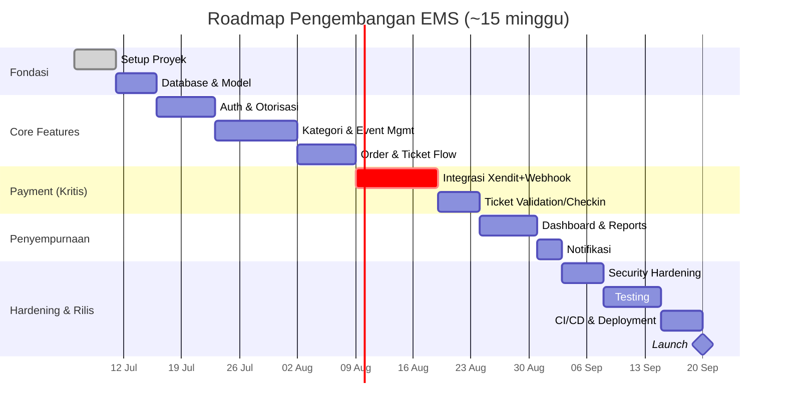

# 🗺️ Development Roadmap — Event Management System

Roadmap ini disusun **iteratif**: fondasi lebih dulu (setup, database, auth), lalu fitur inti (event, order, payment), lalu penyempurnaan (dashboard, notifikasi), dan diakhiri hardening + rilis. Setiap fase memetakan langsung ke Epic pada [`issue.md`](./issue.md).

## Timeline Keseluruhan

> Estimasi minggu bersifat indikatif untuk 1 tim kecil (2-3 developer); sesuaikan dengan kapasitas tim aktual.

---

## Fase 0 — Project Setup & Foundation _(Minggu 1)_

- Inisialisasi repo, folder structure, konfigurasi dasar (env, ESLint/Prettier, logger, error handler, response helper).
- **Output:** skeleton aplikasi Express + EJS berjalan, siap menerima fitur.
- **Epic terkait:** `SETUP` di `issue.md`.

## Fase 1 — Database & Model _(Minggu 1–2)_

- Setup Sequelize, migration & model untuk 7 tabel inti, asosiasi, seeder awal.
- **Output:** skema database final sesuai [`specification.md §2`](./specification.md#2-skema-database-detail), siap dipakai fitur di atasnya.
- **Epic terkait:** `DB`.
- **Dependensi:** Fase 0 selesai.

## Fase 2 — Autentikasi & Otorisasi _(Minggu 2–3)_

- Register, login, JWT, middleware auth & RBAC, forgot/reset password.
- **Output:** seluruh endpoint terlindungi dapat membedakan role customer/organizer/admin.
- **Epic terkait:** `AUTH`.

## Fase 3 — Kategori & Event Management _(Minggu 3–5)_

- CRUD kategori, CRUD event, publish/unpublish, upload banner & lampiran, search & filter, statistik event.
- **Output:** organizer dapat mengelola event end-to-end; customer dapat browsing.
- **Epic terkait:** `CAT`, `EVT`.

## Fase 4 — Order & Ticket Purchase Flow _(Minggu 5–6.5)_

- Buat order, validasi kuota (dengan transaction lock), kalkulasi total, riwayat & pembatalan order, job auto-expire.
- **Output:** alur order berfungsi penuh **tanpa** pembayaran nyata (payment masih placeholder/mock).
- **Epic terkait:** `ORD`.

## Fase 5 — Integrasi Payment Xendit & Webhook _(Minggu 6.5–8.5)_ 🔴 Kritis

- Setup akun & credential Xendit, buat invoice saat order dibuat, endpoint & verifikasi webhook, status mapping, idempotency.
- **Output:** status pembayaran ter-update otomatis end-to-end (order → invoice → bayar → webhook → tiket digenerate).
- **Epic terkait:** `PAY`.
- **Dependensi penting:** akun Xendit (sandbox) & tunnel (ngrok) untuk testing webhook lokal harus disiapkan **sebelum** fase ini dimulai.

## Fase 6 — Ticket Validation & Check-in _(Minggu 8.5–9.5)_

- Generate ticket code & QR, endpoint download e-ticket (PDF), scan & check-in, proteksi duplikat check-in.
- **Output:** organizer dapat memvalidasi kehadiran secara real-time di venue.
- **Epic terkait:** `TIX`.

## Fase 7 — Dashboard & Reports _(Minggu 9.5–10.5)_

- Dashboard organizer & admin, berbagai laporan (penjualan, revenue, performa event, platform).
- **Epic terkait:** `DASH`.

## Fase 8 — Notifikasi _(Minggu 10.5–11)_

- Setup email service, notifikasi lifecycle order/payment/event ke customer, organizer, dan admin.
- **Epic terkait:** `NOTIF`.

## Fase 9 — Security Hardening _(Minggu 11–11.5)_

- Helmet, CORS whitelist, rate limiting, CSRF, audit XSS/SQLi, review hashing & secret.
- **Epic terkait:** `SEC`.

## Fase 10 — Testing _(Minggu 11.5–12.5)_

- Unit test service layer, integration test endpoint utama, test khusus webhook (mock payload Xendit), coverage report.
- **Epic terkait:** `TEST`.

## Fase 11 — CI/CD & Deployment _(Minggu 12.5–13.5)_

- Dockerize, pipeline lint/test otomatis, pipeline deploy, environment staging/production, reverse proxy, backup, monitoring dasar.
- **Epic terkait:** `CICD`.

## Fase 12 — Launch & Post-Launch _(Minggu 13.5–14)_

- Dokumentasi API final, UAT, go-live, smoke test production (termasuk verifikasi webhook production benar-benar diterima Xendit).
- **Epic terkait:** `DOC`.

---

## Ringkasan Milestone

| Fase | Nama                | Minggu    | Status Keluaran                  |
| ---- | ------------------- | --------- | -------------------------------- |
| 0    | Setup & Foundation  | 1         | Skeleton app jalan               |
| 1    | Database & Model    | 1–2       | Skema final + migration          |
| 2    | Auth & Otorisasi    | 2–3       | Login/RBAC berfungsi             |
| 3    | Kategori & Event    | 3–5       | Event CRUD + publish             |
| 4    | Order & Ticket Flow | 5–6.5     | Order flow (tanpa payment nyata) |
| 5    | Xendit & Webhook 🔴 | 6.5–8.5   | Payment end-to-end otomatis      |
| 6    | Ticket & Check-in   | 8.5–9.5   | QR scan & check-in               |
| 7    | Dashboard & Report  | 9.5–10.5  | Visibilitas data                 |
| 8    | Notifikasi          | 10.5–11   | Email lifecycle                  |
| 9    | Security Hardening  | 11–11.5   | Produksi-siap secara keamanan    |
| 10   | Testing             | 11.5–12.5 | Coverage memadai                 |
| 11   | CI/CD & Deployment  | 12.5–13.5 | Pipeline otomatis                |
| 12   | Launch              | 13.5–14   | Live di production               |

## Catatan Dependensi

- **Fase 5 (Xendit)** adalah titik risiko tertinggi proyek — pastikan sandbox account, secret key, dan callback verification token sudah tersedia sebelum fase dimulai.
- **Webhook production** hanya bisa diverifikasi setelah domain memiliki **HTTPS aktif** — koordinasikan dengan Fase 11 (CI/CD & Deployment) sebelum go-live.
- Fase 7–9 (Dashboard, Notifikasi, Security) dapat **dikerjakan paralel** oleh anggota tim berbeda karena tidak saling bergantung secara langsung, selama Fase 0–6 sudah stabil.
